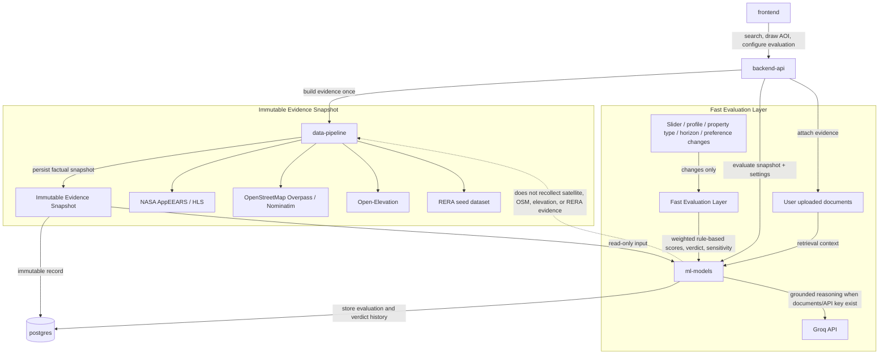

# TerraScope Architecture

TerraScope separates evidence collection from investor-specific evaluation. The evidence snapshot is collected once and treated as immutable; changing sliders, profiles, property types, horizons, or preferences only re-runs the fast evaluation layer.

## Separation Of Responsibilities

- **Immutable Evidence Snapshot:** the blocking, factual collection stage. It uses the user-defined GeoJSON polygon as the canonical AOI, gathers satellite, infrastructure, elevation, RERA, and uploaded-document evidence, then persists the snapshot.
- **Fast Evaluation Layer:** the deterministic decision stage. It reads the immutable snapshot and applies profile-specific weights and preferences. Slider and profile changes stay here and must not call satellite, OSM, elevation, or RERA connectors again.
